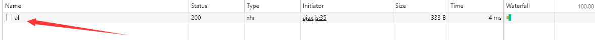
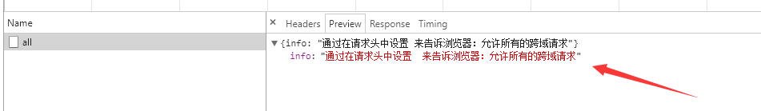
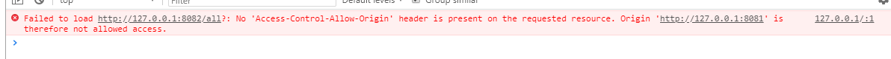
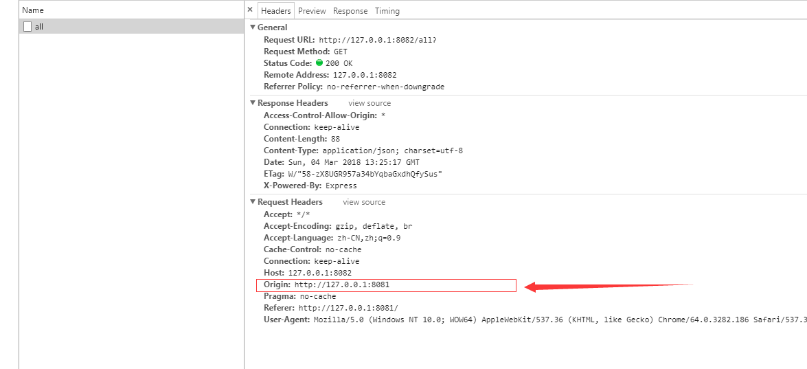
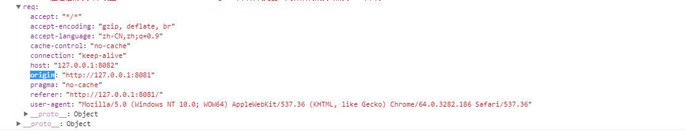
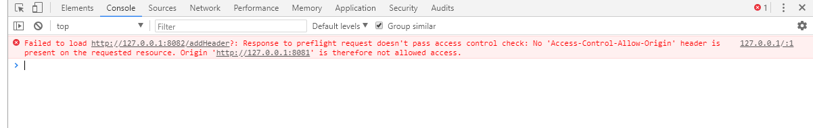
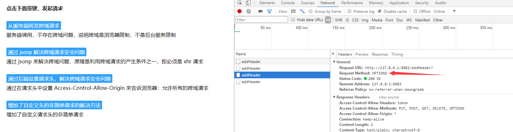

## 整理 Ajax 相关内容

### 示例代码启动命令  
#### npm i
#### npm run start

### 项目目录介绍  
#### ajax 简易 Ajax 及 jsonp 封装
#### public 静态资源文件夹
#### index.html 前端静态页面  
#### client.js 提供客户端服务    
#### server.js 模拟后台服务，响应接口调用  
*****

关于 ajax 的相关内容，几乎一直是面试中的必考题，在看了慕课网中关于 ajax 跨域的全面讲解之后，加深了自己对 ajax 跨域的理解，结合自己以往的经验，做出了下面学习笔记。视频连接请[点击这里](https://www.imooc.com/learn/947)。再次感谢晓风清老师的讲解。

### Ajax
Ajax 不是一种编程语言，而是一种在无需重新加载整个网页的情况下，能够更新部分网页的技术。它的出现大大优化了用户体验。所有现代浏览器（IE7+、Firefox、Chrome、Safari 以及 Opera）均内建 XMLHttpRequest 对象（IE5 和 IE6 使用 ActiveXObject）。

使用 Ajax 与后台服务建立通信大致可分为以下三步：

1、实例化 XMLHttpRequest（或 ActiveXObject）对象
  ```
  let xhr;
  if (window.XMLHttpRequest){
      xhr = new XMLHttpRequest();
  }else{
      xhr = new ActiveXObject('Microsoft.XMLHTTP')
  }
  ```
2、发送请求
```
  if (options.type == 'GET'){
      xhr.open("GET",options.url + '?' + options.data ,options.async);
      xhr.send(null)
  }else if (options.type == 'POST'){
      xhr.open('POST',options.url,options.async);
      // POST请求设置请求头
      xhr.setRequestHeader('Content-Type','application/x-www-form-urlencoded');
      xhr.send(options.data);
  }
```
> open 方法规定请求的类型、URL 以及是否异步处理请求等信息。  
> send 方法来向后台发送一个请求，在 post 请求中，我们将请求数据作为 send 方法的参数发送个后台。  
> setRequestHeader 方法用来设置请求头信息。  


3、监听状态码，请求结束后通过回调函数来处理返回数据。
```
  xhr.onreadystatechange = function () {
    if (xhr.readyState == 4){
        var status = xhr.status;
        if (status >= 200 && status < 300 ){
            options.success && options.success(JSON.parse(xhr.responseText));
        }else{
            options.fail && options.fail(status);
        }
    }
  }
```
以上，便完成了前后端的数据交互，[在这里](https://github.com/wumouren/WEB-DEV/blob/master/ajax/ajax/ajax.js)，我做了一个简易的 ajax 封装。

### Ajax 跨域

#### 跨域安全问题的产生
关于 ajax 跨域安全问题的产生，主要是由于浏览器的同源策略：  
> 同源策略限制了从同一个源加载的文档或脚本如何与来自另一个源的资源进行交互。这是一个用于隔离潜在恶意文件的重要安全机制。  
关于源的定义：  
> 如果两个页面的协议，端口（如果有指定）和域名都相同，则两个页面具有相同的源。  

由上可知，当两个页面的协议，端口（如果有指定）和域名都不相同时，便产生了跨域问题。

基于以上原因，当我们的 http 请求出现跨域时，便会遭到浏览器的限制（注意：是浏览器的限制，在一段时间内，我曾一度以为，跨域是由于后台服务的限制！）。

由此，我们可以得出跨域安全问题产生的条件：  
> 1、浏览器限制。  
> 2、遵循同源策略。（XMLHttpRequest遵循同源策略）  

以上条件必须同时满足，才会产生跨域安全问题。

#### 解决跨域的思路
既然跨域安全问题的产生必须同时满足以上两个条件，那么我们便可以从下面这两个方面来解决跨域安全问题：  
1、解决浏览器限制问题   
  1）我们可以在打开浏览器时，手动关闭浏览器的限制，但是这个解决方法几乎毫无用处，我们不可能要求每个用户每次访问网站时都来进行手动操作。   
  2）代理转发。我们可以在同源下利用代理服务器来转发请求，避过浏览器限制。       
  3）通过在后端配置请求头信息，来告诉浏览器，允许对方跨域访问。（CORS）  
2、采取非同源策略限制下的其他手段。（JSONP）

#### 具体实现    
一、首先我们来聊一聊广为人知的解决手段 JSONP  
我们可以通过动态来创建一个 script 标签，来向后台请求数据信息，在请求参数里带入前后端约定的回调函数名称，来实现在返回 script 文件中调用数据处理函数。
```
  const head = document.getElementsByTagName('head')[0];  
  const s = document.createElement('script');  
  let jsonpCallback = `?callback=${callbackName}`;  
  s.src = url + jsonpCallback;  
  head.appendChild(s);  
``` 
但这个方法存在一些弊端：   
1、首先，因为回掉函数名是通过 url 带入的参数，所以 JSONP 只支持 get 请求。  
2、其次，这个方法需要前后端约定好，当后台服务非本公司或无法改动时，则无法实现 JSONP。  

[在这里](https://github.com/wumouren/WEB-DEV/blob/master/ajax/ajax/jsonp.js)我做了一个简易的 JSONP 封装。


二、解决浏览器的限制   
手动关闭浏览器限制的方法，因其实用性不大，这里不做赘述。  
1、通过代理转发  
1）node 转发。  
我们可以在本域下创建 node 代理服务，来转发请求：   
node 服务代码  详细代码示例，请看[这里](https://github.com/wumouren/WEB-DEV/blob/master/ajax/server.js)  
```
const express = require('express');  
const request = require('request');  
express()  
  .get('/proxy',(req,res) => {  
    request(req.query.proxy, function (error, response, body) {  
      res.send(body);  
    });  
  })  
  .listen(8081)  
```

前端 js 代码   详细代码示例，请看[这里](https://github.com/wumouren/WEB-DEV/blob/master/ajax/client.js)   
```
$('#proxyBtn').addEventListener('click',(e) => {
  ajax({
    url: proxyUrl + 'proxy',
    proxy: serverUrl + 'proxy',
    type: 'GET',
    async: true,
    success: function(res,data){
      $('#proxy').innerText = res.info;
    },
  })
})

```
2) Nginx 转发（关于 Nginx 我所知不多，描述不对之处，望批评指正！）   
这里需要大家安装 Nginx ,关于 Nginx 的安装，网上教程很多，这里不做赘述。（下面是我阿里云的 Nginx 配置截图）   
在安装完 Nginx 后,我们打开 Nginx 的配置文件：
  
在配置文件中我们可以找到上图红框中的一句话，表明 Nginx 会从该路径加载 Nginx 的配置。我们可以在该文件夹下新增配置文件，来转发请求：    
    
   
其中 ：
> server_name 来设置我们监听的同源请求路径。   
> porxy_pass 来设置需要转发的请求地址。  

然后重新启动 Nginx 来重新载入配置项，完成请求的代理转发。

2、后端配置请求头（CORS）   

1) 通过设置 Access-Control-Allow-Origin 来允许跨域  
首先我们来看几张截图：   
      
     
      
    
通过上图，我们可以看到，跨域请求已经成功，后台数据也已经返回，而控制台却依旧报跨域安全错误，更加充分的说明了，跨域安全错误是浏览器多管闲事，并非是后台服务的限制。在图中，我们还可以还看到，跨域请求的请求头中比非跨域请求多出了一个 Origin 参数，表明了请求来源。我们将跨域请求的请求头打印出来观察，如下图：  
    
因此，我们可以通过在请求头中添加 Access-Control-Allow-Origin 属性，来告诉浏览器：允许该来源的跨域请求。
```
  .get('/all',(req,res) => {
    res.set('Access-Control-Allow-Origin',req.headers.origin);
    res.send({ info : '通过在请求头中设置 Access-Control-Allow-Origin 来告诉浏览器：允许所有的跨域请求（当带有 cookie）'})
  })
```

详细示例代码在[这里](https://github.com/wumouren/WEB-DEV/blob/master/ajax/server.js)

2) 简单请求和非简单请求（详细内容请看[这里](https://developer.mozilla.org/zh-CN/docs/Web/HTTP/Access_control_CORS#Preflighted_requests),或者[这里](http://www.ruanyifeng.com/blog/2016/04/cors.html)）。   
跨域请求可以分为简单请求和非简单请求，同时满足以下所有条件的请求称之为简单请求：  
> 使用下列方法之一：  
>   GET  
>   HEAD  
>   POST  
> Fetch 规范定义了对 CORS 安全的首部字段集合，不得人为设置该集合之外的其他首部字段。该集合为：  
>   Accept  
>   Accept-Language  
>   Content-Language  
>   Content-Type （需要注意额外的限制）  
>   DPR  
>   Downlink  
>   Save-Data  
>   Viewport-Width  
>   Width  
> Content-Type 的值仅限于下列三者之一：  
>   text/plain  
>   multipart/form-data  
>   application/x-www-form-urlencoded  

我们在实际工作中，有时会在请求中添加自定义请求头来满足业务需求，例如：添加 token 做身份校验。此时，我们便发出了一条非简单请求。如下图：    
         
   


观察图片信息，我们可以看到，当我们添加自定义请求头时，浏览器会先发送 OPTION 预检请求，来和后台进行确信，当后台响应头中不存在我们添加的自定义头时，便会报错。
我们可以在后台服务中做以下处理：  
```
  .all('*',(req,res,next) => {
    res.header('Access-Control-Allow-Origin', '*');
    res.header('Access-Control-Allow-Headers', 'token');
    res.header('Access-Control-Allow-Methods', 'PUT, POST, GET, DELETE, OPTIONS');
    if (req.method == 'OPTIONS') {
      res.send(200); 
    } else {
      next();
    }
  })
```

在响应头中添加自定义的请求头，让浏览器通过预检请求，发出真正的请求信息。   
> next 参数的作用在于让代码往下执行，因为 * 号可以匹配所有的路由，如果不调用 next ,则下面所有的请求都会被拦截下来。

详细示例代码在[这里](https://github.com/wumouren/WEB-DEV/blob/master/ajax/server.js)
虽然解决了自定义请求头的跨域问题,但是这里还有一个问题，如图：  
  

观察图片我们看到：每次的跨域请求，浏览器都会发送预检信息。    
这个问题我们可以通过设置 Access-Control-Max-age 缓存预检命令结果来进行优化。

### 以上便是这次笔记的所有内容，若有描述不对的地方，望大家批评指正


